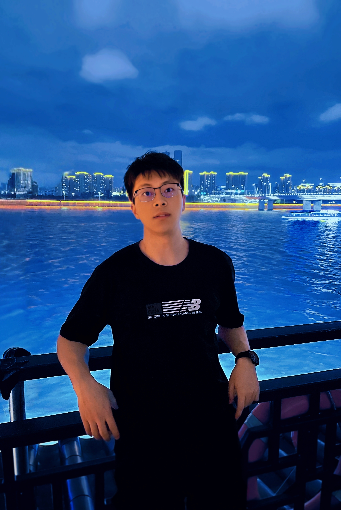

My name is **Yinsong Yan** (闫银松). I am currently a PhD student in the [Department of Data Science and Artificial Intelligence (**DSAI**)](https://www.polyu.edu.hk/dsai/) at [The Hong Kong Polytechnic University](https://www.polyu.edu.hk/), Hong Kong, under the supervision of [Prof. Jibin Wu](https://www.polyu.edu.hk/dsai/people/academic-staff/wujibin/?sc_lang=en) and [Prof. Kay Chen Tan](https://www.polyu.edu.hk/dsai/people/academic-staff/tankaychen/).

I received my bachelor's degree in Applied Mathematics from the [University of Electronic Science and Technology of China](https://www.uestc.edu.cn/) in 2020, and my master's degree in Applied Mathematics from [Xi'an Jiaotong University](https://www.xjtu.edu.cn/) in 2023.

My research focuses on multimodal foundation models and brain-inspired, energy-efficient algorithms. I work on multimodal perception and online interaction, while also exploring neuromorphic computing paradigms and brain-inspired machine intelligence.

By drawing insights from the brain's energy-efficient information processing, I aim to enhance algorithmic performance for complex tasks while reducing computational overhead. My interdisciplinary approach combines mathematics, neuroscience, and computing.

I am always open to research discussions and collaborations. Please feel free to reach out via email.

<strong>Email:</strong> 

  <em>yinsong.yan[AT]connect.polyu.hk</em>
  <button type="button" class="email-copy" aria-label="Copy email" title="Click to copy">📋</button>

---

# CURRENT RESEARCH

1. Multimodal Foundation Model
   - Multimodal perception
   - Online interaction
2. Brain-Inspired Efficient AI
   - Biological neural mechanisms for efficient information processing
   - Robust and energy-efficient machine intelligence
3. Neuromorphic Computing
   - Event-driven computation and sparse neural activity
   - Energy-efficient algorithms for resource-constrained systems

---

# NEWS
- [2026-01] Our paper on spatiotemporal representations in spiking neural networks was accepted by **ICLR 2026**.
- [2025-09] Our paper on efficient and robust temporal processing with neural oscillations modulated spiking neural networks was published in **Nature Communications**.

---

# INTERNSHIPS

  

    
    
  

  

    <strong>2026-02-28–Present</strong> — Research Intern, <strong>Alibaba Tongyi Lab</strong>. Working on online interaction in Qwen-Omni, with a focus on multimodal perception and real-time interaction. Mentored by <strong><a href="https://jxu-thu.github.io/" target="_blank" rel="noreferrer">Dr. Jin Xu</a></strong> and <strong><a href="https://patrick-tssn.github.io/" target="_blank" rel="noreferrer">Mr. Yuxuan Wang</a></strong>.
  

---

# SELECTED PUBLICATIONS

You can find the full list on my [**Google Scholar**](https://scholar.google.com/citations?hl=en&view_op=list_works&gmla=AO4B3jv5pOqNENGhVId6S5eDtXH9EqOhvmGqUdI_Qm9rMrscJzxkn4yoOLsdAvtRpH8sBGv-8b___5iEfdwtP6WH0eTS&user=Sj9BTwIAAAAJ).

<strong>&dagger;</strong> denotes the corresponding author(s).

## <u>First-Author / Project Leader</u>

1. ***Efficient and robust temporal processing with neural oscillations modulated spiking neural networks***
   * **Yinsong Yan**, Qu Yang, Yujie Wu, Hanwen Liu, Malu Zhang, Haizhou Li, Kay Chen Tan, Jibin Wu
   * **Nature Communications 2025**
   * We introduce Rhythm-SNN, a neural modulation framework inspired by brain oscillations for robust and energy-efficient temporal processing.
   [Paper](https://doi.org/10.1038/s41467-025-63771-x), [Code](https://github.com/YinsongYan/Rhythm-SNN)

1. ***Advancing Spatiotemporal Representations in Spiking Neural Networks via Parametric Invertible Transformation***
   * **Yinsong Yan**, Yujie Wu, Jibin Wu
   * **International Conference on Learning Representations (ICLR) 2026**
   * We propose a parametric invertible transformation to expand spatiotemporal representations and improve learning dynamics in spiking neural networks.
   [Paper](https://openreview.net/forum?id=3JwNXQzxll), [Code](https://github.com/YinsongYan/ICLR26)

1. ***MD3Net: Integrating Model-Driven and Data-Driven Approaches for Pansharpening***
   * **Yinsong Yan**, Junmin Liu, Shuang Xu, Yicheng Wang, Xiangyong Cao
   * **IEEE Transactions on Geoscience and Remote Sensing 2022**
   * We combine model-driven and data-driven approaches for the ill-posed multimodal image-fusion task of pansharpening.
   [Paper](https://doi.org/10.1109/TGRS.2022.3196427), [Code](https://github.com/YinsongYan/M3DNet)

## <u>Collaborative Works</u>

1. ***[PMSN: A Parallel Multi-Compartment Spiking Neuron for Multiscale Temporal Processing](https://scholar.google.com/citations?view_op=view_citation&hl=en&user=Sj9BTwIAAAAJ&citation_for_view=Sj9BTwIAAAAJ:IjCSPb-OGe4C)***
   * X. Chen, Jibin Wu, C. Ma, **Yinsong Yan**, H. Liu, Y. Wu, Kay Chen Tan
   * **IEEE Transactions on Neural Networks and Learning Systems, 2026**

1. ***[Koopstd: Reliable similarity analysis between dynamical systems via approximating Koopman spectrum with timescale decoupling](https://scholar.google.com/citations?view_op=view_citation&hl=en&user=Sj9BTwIAAAAJ&citation_for_view=Sj9BTwIAAAAJ:Y0pCki6q_DkC)***
   * S. Zhang, Z. Ye, **Yinsong Yan**, Z. Song, Y. Wu, Jibin Wu
   * **Forty-second International Conference on Machine Learning (ICML 2025)**

---

# EDUCATION

- **2023–Present** — PhD in Data Science and Artificial Intelligence, The Hong Kong Polytechnic University, Hong Kong.
- **2020–2023** — M.S. in Applied Mathematics, Xi'an Jiaotong University, Xi'an, China.
- **2016–2020** — B.S. in Applied Mathematics, University of Electronic Science and Technology of China, Chengdu, China.

---

# SERVICES

## Conference Reviewer

- IEEE/CVF Conference on Computer Vision and Pattern Recognition (**CVPR**)
- International Conference on Learning Representations (**ICLR**)
- International Conference on Machine Learning (**ICML**)
- Conference on Neural Information Processing Systems (**NeurIPS**)
- European Conference on Computer Vision (**ECCV**)

## Journal Reviewer

- IEEE Transactions on Circuits and Systems for Video Technology (**TCSVT**)
- Neural Networks
- IEEE Transactions on Neural Networks and Learning Systems (**TNNLS**)
- IEEE Transactions on Cognitive and Developmental Systems (**TCDS**)
